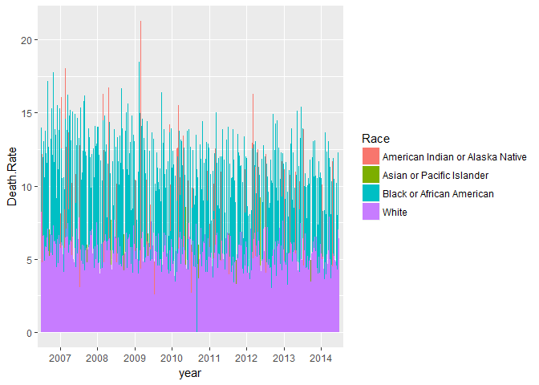

What drives disparities in health outcomes? Research supports the notion that socioeconomic status (SES) has a significant impact on health outcomes. How or why

Social hierarchy is bad (especially for those ranking lower but sometimes for those who rank higher). See work by Jay Kaplan and Robert Sapolsky among others.

First we need to download and place our datasets in a directory

Set working directory as the root directory (where datasets are saved) in knitr as follows (put the code below here and use highlighter for ruby) & include the packages that will be used.

For this post, I wanted to look at infant mortality rates in the US. Linked birth-death data can be obtained from CDC's WONDER services site \[here\] (<https://wonder.cdc.gov/lbd-current.html>). Agree to the terms and specify the type of data you want, export results as a text file. I requested datasets for 8 years (2007-2014) and saved the datasets in my local drive. \[see example of a dataset for 2007 here\] ({{ site.url }}/assets/data07.txt)

However there are some shortcomings with the datasets I have requested and for a general exposition of differences in death rates, I ignored those shortcomings. For instance there are several cells marked 'Unreliable' because of low numbers in those categories. Not all states have data for all race/ethnic groups due to either low numbers of race/ethnic groups in those states or lack of data collection. Because another major reason for this post was to show how to use R to work with several datasets, I feel it is alright to overlook the weaknesses of the datasets.

``` r
#Make a list that contains your data sets provide the right path
#You can use getwd() or provide complete path
mortalityData_list <- list.files(path=getwd(), pattern="*.txt", 
                       full.names = TRUE)
```

The lapply, sapply, tapply... family of functions are very handy in performing the same thing to several variables or datasets etc.

In our case, data sets are .txt files and tab delimited, we will use lapply on the data list created to read in each of them. The 'datalist' object will contain those datasets as a list. You can do typeof(datalist) to confirm that.

``` r
datalist <- lapply(mortalityData_list, read.delim)
```

<!--more-->

DATA CLEANING 
The "Death.Rate" column in those data sets has "(Unreliable)" in some of the cells, we need to remove it, so the code below replaces "(Unreliable)" with nothing. fixed=TRUE so '(' & ')' are removed too

``` r
mortalityData <- lapply(datalist, function(i)
   transform(i, Death.Rate = gsub("(Unreliable)", "", 
                                  fixed = TRUE, Death.Rate))) 

#Let's drop the first columns from the datasets because they are notes. 
mortalityData <- lapply(mortalityData, function(x) x[, -1])

#After dropping the first column, I noticed that there are several rows with 'NA'
# after the last row of the data in each table, so we have to removes "NA" as follows.
mortalityData <- lapply(mortalityData, function(y) y[rowSums(is.na(y)) == 0, ])

#I can transform some of the columns to factor or numeric ...
mortalityData <- lapply(mortalityData, transform, Death.Rate=as.numeric(Death.Rate), 
                  State=as.factor(State), Race=as.factor(Race), 
                State.Code=as.factor(State.Code))
```

We need to include a time variable for each of the 8 datasets So, we create a list of years & populate a column with specific year for each dataset.

``` r
years <- list(2007, 2008, 2009, 2010, 2011, 2012, 2013, 2014)

#Add year indicator to each data frame in the list as follows
for( i in seq_along(mortalityData)){
  mortalityData[[i]]$year <- rep(years[i], nrow(mortalityData[[i]]))
}
```

combine data frames to one long form if you like but one can also operate on each of the datasets without row-binding

``` r
mortalityData_long <- as.data.frame(do.call("rbind", mortalityData))

#I just realized that the "year" variable I added above 
#is a list and ggplot doesn't know 
#what to dow with it, so change it using "unnest" function from tidyr package

mortalityData_long <- unnest(mortalityData_long, year)

mortalityData_long[,3] <- as.factor(mortalityData_long$Race)
mortalityData_long[,8] <- as.factor(mortalityData_long$year) #Just so all the years appear on horiz axis
```

#### Plots

First, let's just plot that data as it is for each year. This only gives a general idea of the trends across states and years by race. Where data are available, it looks like minorities (other than Hispanic/Latino who identify as White) experience higher death rates. I should note here that in several states data for American Indian/Alaska Native and Asian/Pacific Islander are not available. In some

``` r
#Plots

childMortality_plot1 <- ggplot(data=mortalityData_long, 
                     aes(x=year , y=Death.Rate, group=State, 
                         fill=Race, na.rm=TRUE)) + 
  geom_bar(stat="identity", width = 1, position=position_dodge())

#Reveal plot
childMortality_plot1
```



But we can look at the data nationally. To do that, we quickly compute new variables as follows: Let's create 3 variables on the fly and we will use them for ggploting. This will render the "State" variable useless. (By race & by year nationally is what I'm after)

``` r
#using the 'pipe' %>% operator
mortalityData_long <- mortalityData_long %>% group_by(year, Race) %>%
  mutate(tot_Deaths = sum(Deaths), tot_Births=sum(Births), 
         Child_Mortality_Rates=(round(tot_Deaths/tot_Births*1000, 1)))
```

The new plot clearly shows higher child mortality rates for Amrican Indian/Alaska Natives & Black/African American. Asian/Pacific Islander has the lowest. Mortality rates for Caucasian Whites are probably higher than mortality rates for Hispanic/Latinos. The bars for the White group includes Hispanic/Latino ethnicity that identify as White and there are some indications that child mortality rates are lower for Hispanics/Latinos.

``` r
#New Plot (childMortality_plot2)
childMortality_plot2 <- ggplot(data=mortalityData_long, 
                     aes(x=year , y=Child_Mortality_Rates, group=Race, 
                         fill=Race, na.rm=TRUE)) + 
  geom_bar(stat='identity', position=position_dodge()) +
geom_text(aes(label=Child_Mortality_Rates), vjust=1.6, color='white', 
          position=position_dodge(0.9), size=2.5)


#Reveal new plot
childMortality_plot2
```


